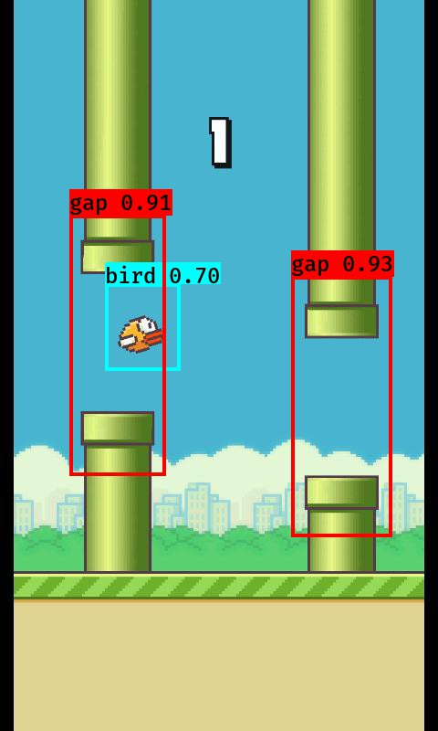

# flappy_yolo

### Description
a programme can dectect the bird and the gaps in flappy bird and control the bird to go through these gaps

### Requirements
libraries needed by [YAD2K](https://github.com/allanzelener/YAD2K)

### ScreenShot

### How to run
First due to the limite of storage space in github,i'm sorry that you need to download necessary big files [here](https://drive.google.com/drive/folders/0B1AgjhsIy5U6VGwwTEoyR2oyMXM?usp=sharing) once have cloned the project.  
And put these files(only 2 files) into "model_data" folder.Then input "python flappy.py" and enjoy the game!
### Stand on the shoulders of the giants
[yolo](https://pjreddie.com/darknet/yolo/)  
[YAD2K](https://github.com/allanzelener/YAD2K) :provide a yolo coded by python  
[flappy bird](https://github.com/sourabhv/FlapPyBird) :flappy bird game coded by python-pygame

--------------------------------------------------------------------------------
